# Mirror Mirror On The Wall

> ### Build your own voice-controlled Magic Mirror


1. [Prerequisites]()
1. [Magic Mirror]()
1. [AWS IoT Core]()
1. [Alexa Skill]()
1. [AWS Lambda]()
1. [Magic Mirror Module]()


## Prerequisites

- [Amazon AWS developer account](https://aws.amazon.com/free/)
- [Alexa Skills developer account](https://developer.amazon.com/alexa-skills-kit)
- Install [Node.js v10.x](https://nodejs.org/en/)
- *Install [Git](https://git-scm.com/downloads)

*__Windows users__: 
You must have a Linux Bash Shell to do this Workshop. When you are installing Git, please follow these instructions (https://learn.adafruit.com/windows-tools-for-the-electrical-engineer/git-plus-command-line-tools) to use the Unix tools from the Windows Command Prompt.


## Magic Mirror

> ### repo: [MagicMirror](https://github.com/MichMich/MagicMirror)

We are using an open source [MagicMirror²](https://github.com/MichMich/MagicMirror) software platform that will allow you to convert your hallway or bathroom mirror into your personal assistant.

To toggle the (web) Developer Tools from mirror mode, use `CTRL-SHIFT-I` or `ALT` and select `View`.

### Installation

1. Open your command line

2. Download the repository to your laptop

`git clone https://github.com/MichMich/MagicMirror.git`

3. Enter the repository

`cd MagicMirror/`

4. Install node libraries

`npm install`

5. Navigate to the config folder and rename config.js.sample to config.js

`cd config/`

`mv config.js.sample config.js`

6. Run the app

`npm start`


## AWS IoT Core

We need to setup an AWS IoT Device Gateway. It works as a hub that will allow an Alexa Skill to send messages to it and a Magic Mirror to subscribe to new messages from it. This will let us control our Magic Mirror with our voice. 
 
  1. Login to __[AWS Management Console](https://console.aws.amazon.com/console/home?region=us-east-1)__
  

  1. Choose __US East (N. Virginia)__ region
  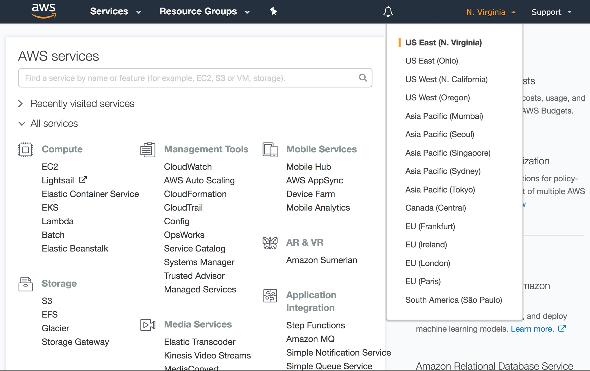

  1. Find __IoT Core__ service
  

  1. Click on __Onboard__ at the left menu bar, under _Configuring a device_, click on __Get Started__
  

  1. Click on __Get Started__
  

  1. Choose __Linux/OSX__ platform, and __Node.js__
  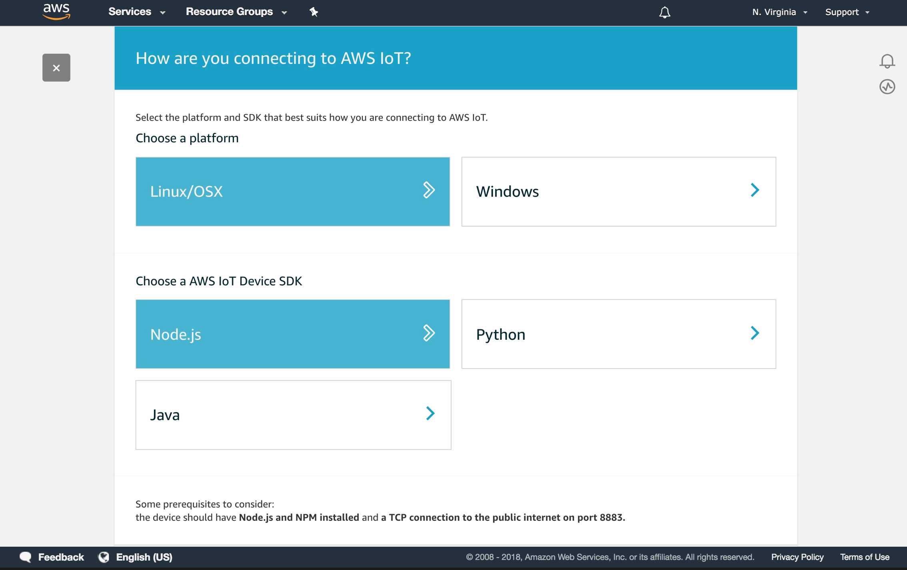

  1. Name your device __MagicMirror__
  

  1. Download credentials, aka connection kit
  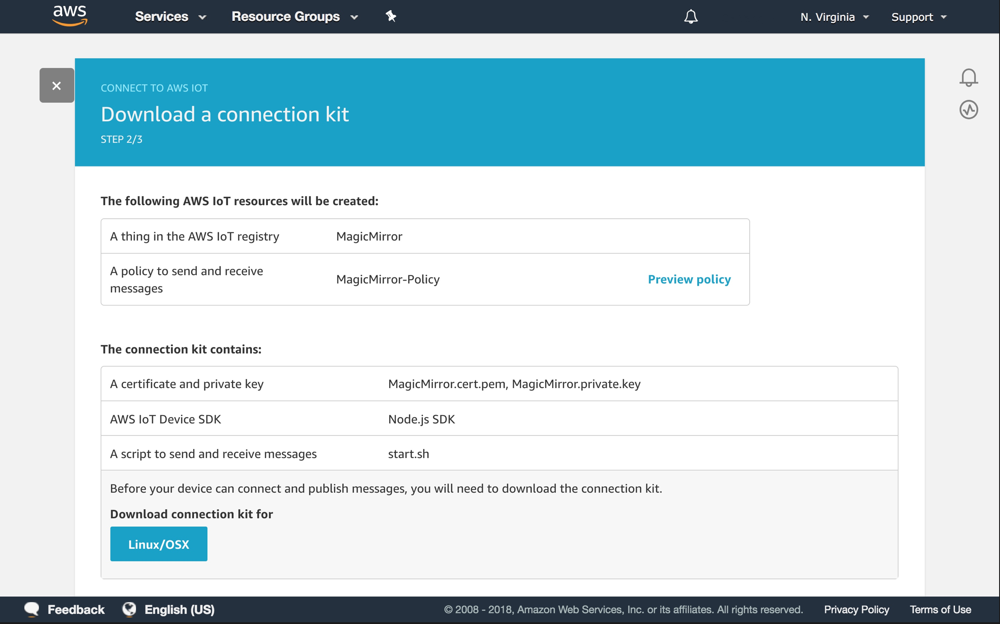

  1. Click on __Next step__
  

  1. Follow the instructions to run the start.sh script, which will generate a root-CA.crt
  
  
  
  
  
  *_Note: Don’t worry about errors as long as you get a root-CA.crt file_
  *_Note note: You will need to copy the credential files here for Lambda function deployment later_

  1. Go back to the AWS web page, click on Done
  

  1. Open the MagicMirror Thing you just created
  
  
  1. Click on Interact on the left menu bar, see the HTTPS Rest API Endpoint in the format of `xxxxxxxxxxxxxxx.iot.us-east-1.amazonaws.com`? You will need to copy this endpoint for Lambda function deployment later
  
  

## Alexa Skill

In this section, we build the language model for our Alexa Skill by defining the commands that Alexa can recognize.

### Configuration

  1. Go to the [Alexa Developer Console](https://developer.amazon.com/alexa/console/ask)

  1. Click on the __Create Skill__ button.
  

  1. Name your Skill (any name is fine), select __Custom__ model, and click the __Create a skill__ button.
  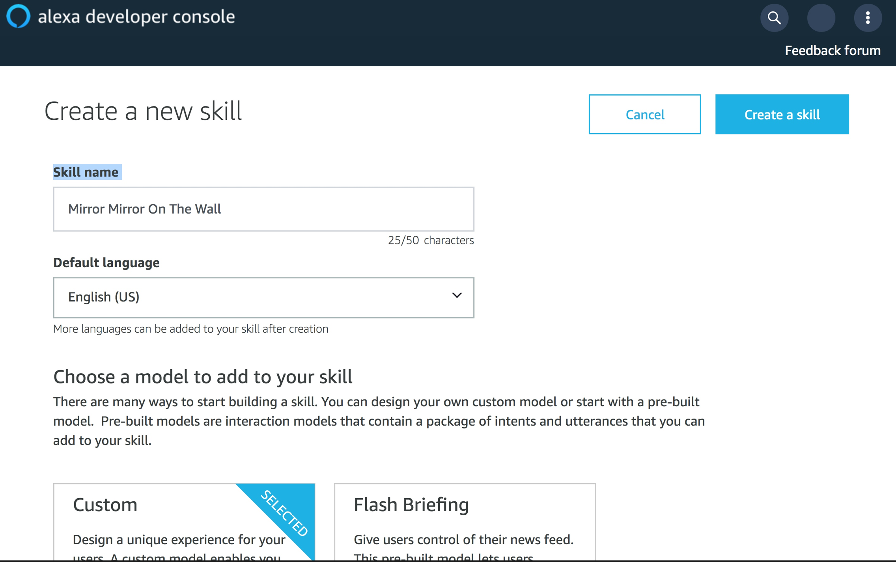
  
  1. Choose Start from scratch template

  1. Click on __Invocation__ on the left menu bar. Set “mirror mirror on the wall” as the invocation name (or any unique phrase). This is the phrase used to activate your skill. __Save Model__.
  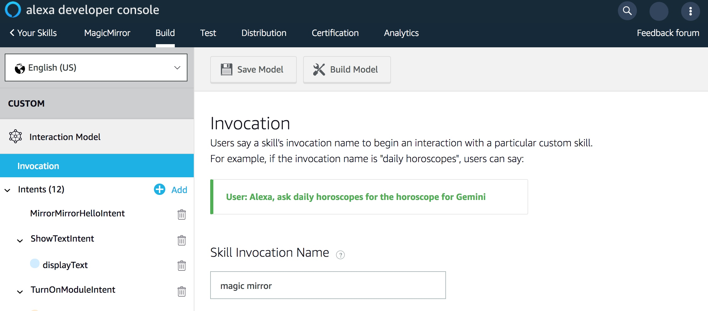

  1. Click on _JSON Editor_ on the left menu bar. Delete everything in there. 

  1. Go to [__InteractionModel.json__]() in the speechAssets folder, and copy everything in the file, and paste it in JSON Editor. __Save Model__.
  
  
  1. Click __Build Model__ on the main page.
  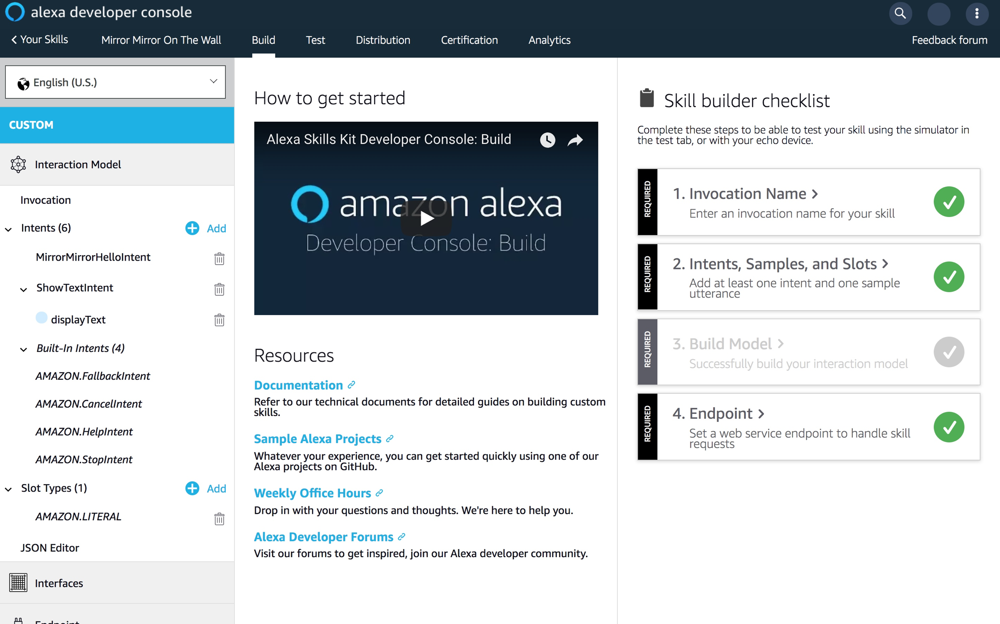
  
  1. Click on __Endpoint__ on the left menu bar. Select __AWS Lambda ARN__. Copy your __Skill ID__ to be used later in Lambda function deployment
  

  


## AWS Lambda

### Prepare code

  1. Copy all your credential files, then go to your local copy of this repo, and paste them inside the __certs__ folder (which is inside the __src__ folder)
  


  1. Click __Your Skills__ at the top. In the skills list, click __View Skill ID__ under MirrorMirrorOnTheWall and copy it.
  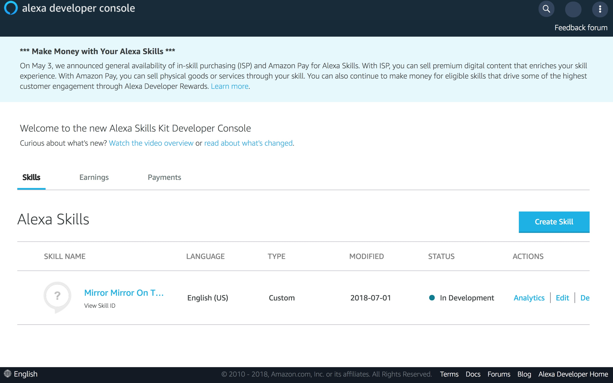

  1. Paste the Application Id into the index.js file for the variable __APP_ID__, and save the change
  

  1. Delete the zip file generated in Section 3 Step 1, and generate a new zip file using the same method. Upload the new zip file to Lambda. This step makes sure the Lambda function only serves request from an authorized source.
  
  
## 2. Install Dependencies

Dependencies are installed by navigating to your __src__ directory on command line, and enter `npm install`.

- [alexa-sdk](https://github.com/alexa/alexa-skills-kit-sdk-for-nodejs) (installed via `npm install`)
- [aws-iot-device-sdk](https://github.com/aws/aws-iot-device-sdk-js) (installed via `npm install`)
- [Google Images Search](https://www.npmjs.com/package/google-images) (installed via `npm install`). Follow the instructions in the link to create your own Google Custom Search Engine, and save the CSE ID and API key in __certs/keys.json__ (see keys_sample.json below).
- [Youtube API](https://www.npmjs.com/package/youtube-node)(installed via `npm install`). Watch this [instruction video](https://youtu.be/Im69kzhpR3I) to create your own Youtube API key, and save it in __certs/keys.json__ (see keys_sample.json below).

### 2.1 keys_sample.json

On your command line, navigate to the __certs__ folder, then enter `cp keys_sample.json keys.json`, which will create a copy of keys_sample.json called keys.json. Copy and paste your API keys obtained above in __keys.json__.

```javascript
// keys_sample.json
{
    "cse": {
        "ID": "YOUR GOOGLE CUSTOM SEARCH ENGINE ID",
        "API_key": "YOUR GOOGLE PROJECT API KEY"
    },
    "youtube": {
        "API_key": "YOUR YOUTUBE API KEY"
    }
}
```

### Deploy
  1. Go inside your local __src__ directory, select all files and folders and then create a zip file, make sure the zip file does not contain the src directory itself, otherwise Lambda function will not work.
  
  

  1. Go to the __[AWS Management Console](https://console.aws.amazon.com/console/home?region=us-east-1)__ and click on the __Lambda__ link. Note: ensure you are in __us-east__ region or you won't be able to use Alexa with Lambda.
  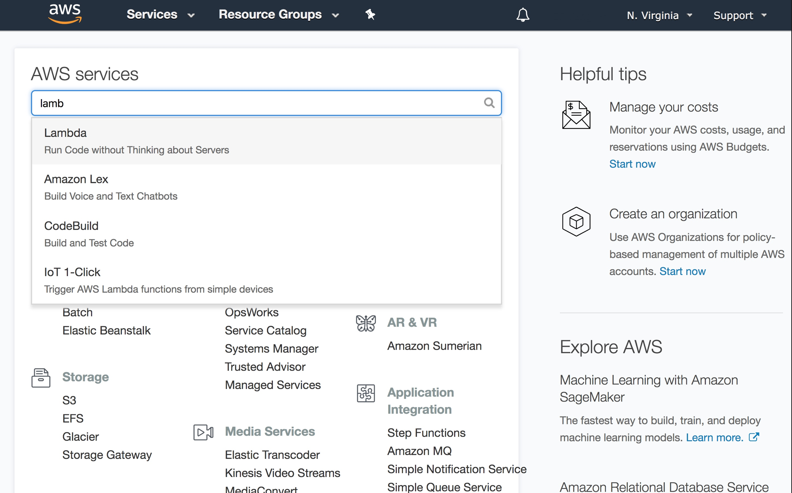

  1. Click on the __Create a Function__ button.
  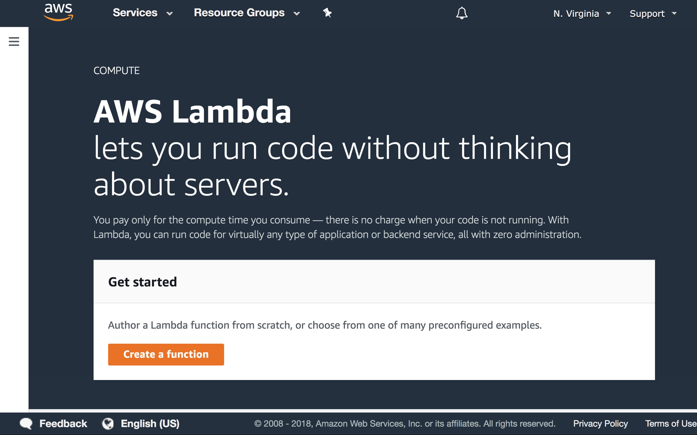

  1. Choose __Author from scratch__. Name the function (any name is fine). Keep the Handler as index.handler (this refers to the index.js file in the zip). __Create new role from template__ and name it anything. Click on the __Create function__ button.
  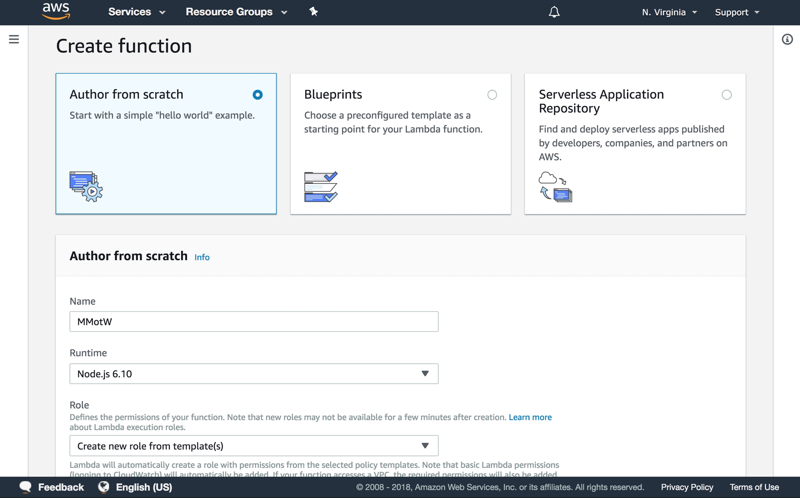
  

  1. Choose trigger __Alexa Skills Kit__ from the left. Disable Skill ID Verification. Click __Add__. Then scroll up and click __Save__.
  
  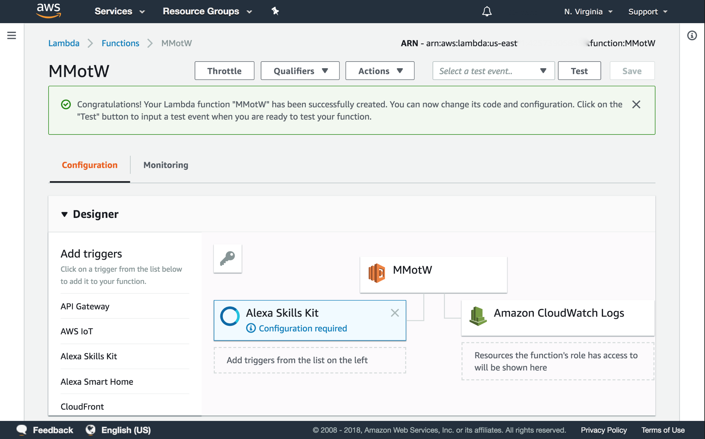
  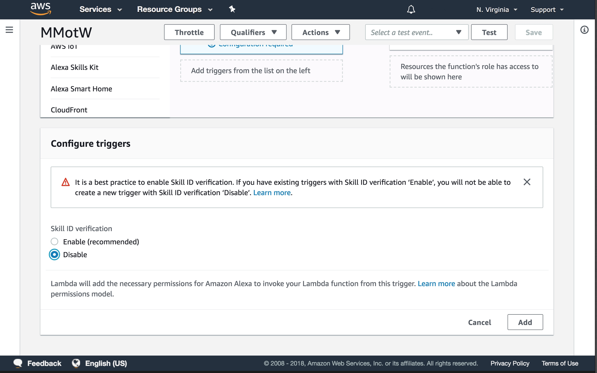
  

  1. With your Lambda function selected, select __Code entry type__ as "Upload a .ZIP file"
  

  1. Click on __Upload__ button, then upload the zip file created in Step 1 to Lambda. Then __Save__.
  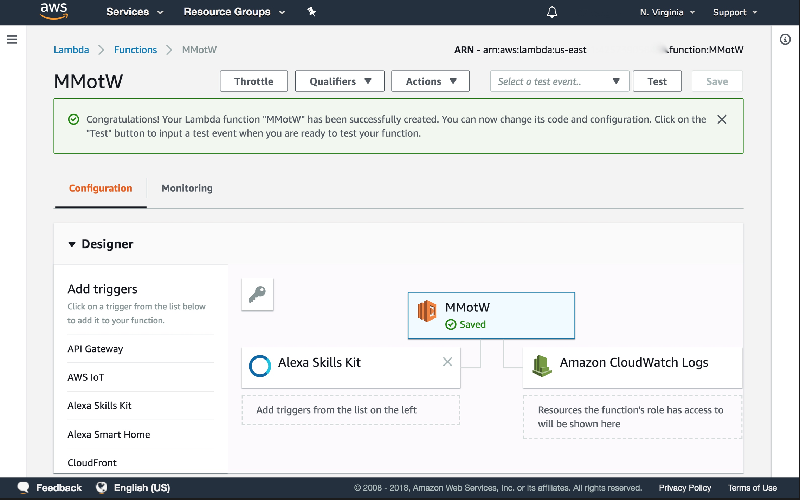

  1. Copy the __ARN__ from the top right to be used later in the Alexa Skill Setup


1. Select __AWS Lambda ARN__ for the skill Endpoint and paste the ARN copied from Section 3 Step 8. Click __Save Endpoints__.
  
  
  
  
  ### Test
  
  1. You can test your Alexa skill by entering invoking it in the Test tab.
  

You are now able to start testing your Alexa skill! You should be able to go to the [Amazon Alexa website](http://alexa.amazon.com/spa/index.html#skills/your-skills/?ref-suffix=ysa_gw) and see your skill enabled.


When you use your skill, you will see the relevant cards show up on the home page.


